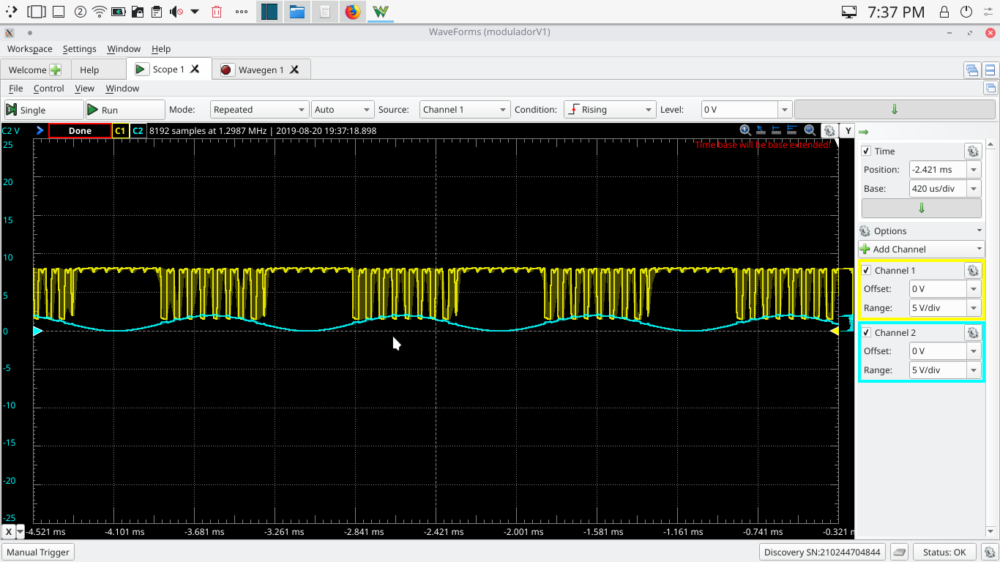
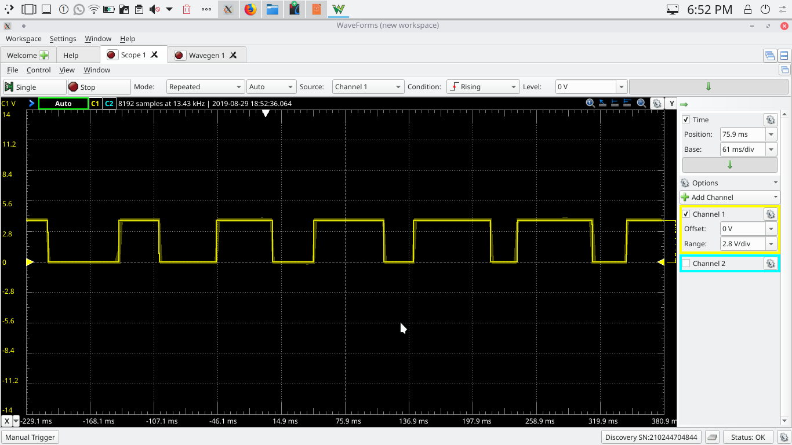

# BITÁCORA AMPLIFICADOR CLASE D

## Integrantes

Mateo Gallego Ramirez

Nicolás Javier Salazar Echeverry 

--------------------------------------------------------------------------
## Justificación del proyecto

El siguiente proyecto fue creado para la clase de señales y sistemas de la [Universidad ICESI](https://www.icesi.edu.co/)

__________________________________________________________________________________________________________________________

## Fase Uno del proyecto: Modulador

Para la primera fase del proyecto se requirió implementar un modulador PWM, para esto se hizo una investigación (todas las fuentes se encuentran 
en las referencias del proyecto al final de la bitácora) sobre como funciona la modulación para un amplificador clase D. 

 #### *Amplificadores operacionales* 
Se encontró que el funcionamiento de los moduladores PWM se pueden implementar con un modulador operacional el cual 
dadas dos señales de entrada 
genera con una multiplicación una señal de salida, para nuestra suerte ya contábamos con un amplificador operacional 
(de algún otro proyecto el 
cual no tengo presente), este era un [JRC 4558](documentos/jrc4558.pdf); conectando un Analog Discovery el cual generaba dos señales, una señal 
triangular con una amplitud
de 4V con una frecuencia de 10Hz y una señal senoidal con una amplitud de 1V y una frecuencia de 1Hz (señal modulada y 
moduladora respectivamente)
conectadas a las entradas del amplificador operacional (alimentado por una bateria de 9V) producían la señal mostrada en la Figura 1.

como se puede ver en la figura esta señal no presenta una modulación correcta esto debido a una posible característica 
interna de JRC 4585, después de esto decidimos probar con un amplificador operacional diferente se tuvo encenta el 
[NE555P](documentos/NE555.pdf) y el [LF353](documentos/LF353.pdf) el primero fue descartado por el hecho de que produce de forma interna
las señales portadora y moduladora, luego utilizamos el LF353 el cual dio como resultado la modulación de la Figura 2 teniendo una triangular con 
una amplitud de 2V y una frecuencia de 10Hz; tambien una señal seno con una amplitud de 500mV y una frecuencia de 1Hz. tambien se debe tener en
cuenta que tuvimos que incrementar el offset a 2V ya que al utilizar una targeta arduino Uno como fuente de coltaje, esta no genera voltaje negativo, 
lo que nos obligaba a subir el valor del offset para no tener perdida de informacion debido a voltajes negativos. 

Nota: la bateria de nueve voltios fue reemplazada por una tarjeta arduino Uno que genera 5V ya que el voltaje de la bateria era muy inestable generando
así una cantidad de ruido considerable, esto se soluciona con la arduino que genera un voltaje mucha mas estable. en una proxima entrega se contempla la
utilizacion de una fuente de poder mas potente y estable.

## Fase Dos del proyecto: Amplificación 

Para la fase dos del proyecto se decidió que es necesario buscar la forma de generar una señal triangular con un circuito
externo, para esto se miraron diferentes opciones entre ellas lgenerarla con una arduino uno en base a [este trabajo](documentos)

